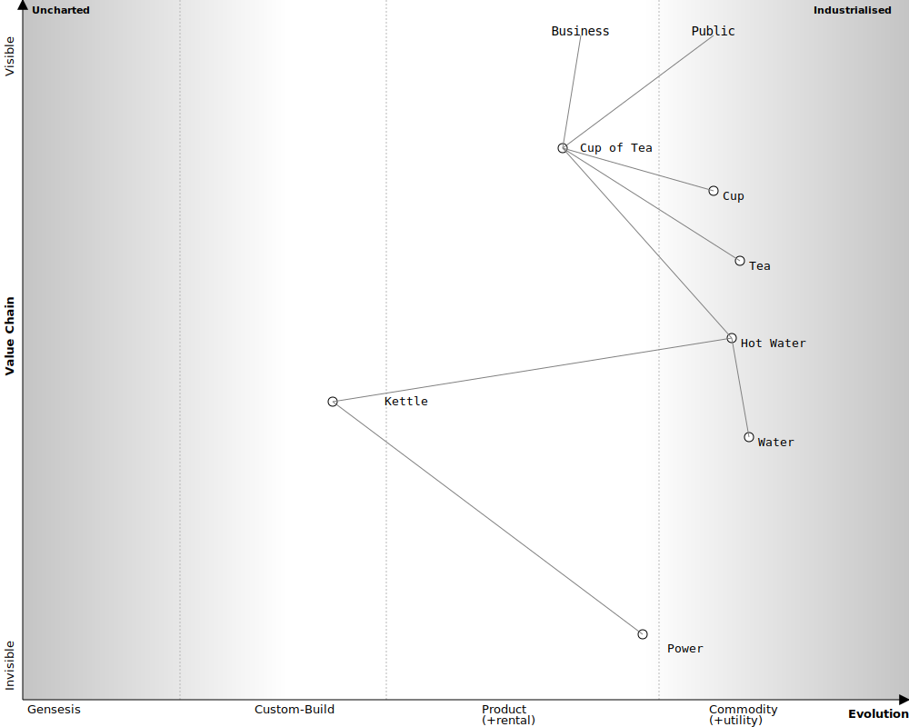

[](https://pkg.go.dev/github.com/owulveryck/wardleyToGo)
[](https://github.com/owulveryck/wardleyToGo/actions/workflows/go.yml)
[](https://codecov.io/gh/owulveryck/wardleyToGo)

## wardleyToGo

simple tools to play with Wardley maps in Go. The syntax is a copy of [onlinewardleymaps](https://onlinewardleymaps.com/). 

_Note_: Not all the DSL is implemented as of today.

A typical flow is to create the map with the online tool and to copy paste it to use with this code.

### About

The entry point is a direct graph.

A parser package is in charge of reading the DSL from an `io.Reader` (stdin in the example). It creates the graph structure.

The `encoding/svg` package turn the graph into its SVG representation (hopefully similar to what onlinewardleynap generates). It is the responsibility of eeach component of the graph to fulfill the `SVGer` interface an to represent itself as SVG.

**Note about the API**: the API is unstable as it is mainly a prrrof f concept. Therefore all the packages are in the `internal` subdirectory to aboid any direct dependency from other package. If you want to test/hack/whatever, feel free to clone and contribute to the package.

## Example

```shell
❯ cat sample.txt | go run . 
```

This generates an SVG of the map

**And**
all the paths connection the elements:

```text
Public -- Cup of Tea -- Hot Water
Public -- Cup of Tea -- Hot Water -- Water
Public -- Cup of Tea -- Hot Water -- [evolved]Kettle
Public -- Cup of Tea -- Hot Water -- Kettle -- [evolved]Power
Public -- Cup of Tea
Public -- Cup of Tea -- Hot Water -- Kettle
Public -- Cup of Tea -- Cup
Public -- Cup of Tea -- Tea
Public -- Cup of Tea -- Hot Water -- Kettle -- Power
Cup of Tea -- Hot Water
Cup of Tea -- Hot Water -- Water
Cup of Tea -- Hot Water -- [evolved]Kettle
Cup of Tea -- Hot Water -- [evolved]Kettle -- [evolved]Power
Cup of Tea -- Cup
Cup of Tea -- Hot Water -- Kettle
Cup of Tea -- Tea
Cup of Tea -- Hot Water -- Kettle -- Power
Hot Water -- Water
Hot Water -- [evolved]Kettle
Hot Water -- [evolved]Kettle -- [evolved]Power
Hot Water -- Kettle
Hot Water -- [evolved]Kettle -- Power
[evolved]Kettle -- Power
[evolved]Kettle -- [evolved]Power
Business -- Cup of Tea -- Hot Water -- Kettle -- Power
Business -- Cup of Tea -- Tea
Business -- Cup of Tea
Business -- Cup of Tea -- Hot Water
Business -- Cup of Tea -- Hot Water -- Water
Business -- Cup of Tea -- Hot Water -- [evolved]Kettle
Business -- Cup of Tea -- Hot Water -- [evolved]Kettle -- [evolved]Power
Business -- Cup of Tea -- Cup
Business -- Cup of Tea -- Hot Water -- Kettle
Kettle -- [evolved]Kettle
Kettle -- [evolved]Power
Kettle -- Power
Power -- [evolved]Power
```

## Usage - DSL

### Wardley Map

#### To set the title (not yet implemented)

`title My Wardley Map`

#### To create a component

`component Name [Visibility (Y Axis), Maturity (X Axis)]`

#### To create a market (not yet implemented)

`market Name [Visibility (Y Axis), Maturity (X Axis)]`

#### Inertia - component likely to face resistance to change. (not yet implemented)

`component Name [Visibility (Y Axis), Maturity (X Axis)] inertia`

#### To evolve a component 

`evole Name (X Axis)`

#### To link components

`Start Component->End Component`

#### To indicate flow (not yet implemented)

`Start Component+<>End Component`

#### To set component as pipeline (not yet implemented)

`pipeline Component Name [X Axis (start), X Axis (end)]`

#### To indicate flow - past components only (not yet implemented)

`Start Component+<End Component`

#### To indicate flow - future components only (not yet implemented)

`Start Component+>End Component`

#### To indicate flow - with label (not yet implemented)

`Start Component+'insert text'>End Component`

#### Pioneers, Settlers, Townplanners area (not yet implemented)

Add areas indicating which type of working approach supports component development

`pioneers [<visibility>, <maturity>, <visibility2>, <maturity2>]`

#### Build, buy, outsource components (not yet implemented)
Highlight a component with a build, buy, or outsource method of execution

* `build <component>`
* `buy <component>`
* `outsource <component>`
* `component Customer [0.9, 0.2] (buy)`
* `component Customer [0.9, 0.2] (build)`
* `component Customer [0.9, 0.2] (outsource)`
* `evolve Customer 0.9 (outsource)`
* `evolve Customer 0.9 (buy)`
* `evolve Customer 0.9 (build)`

#### Link submap to a component (not yet implemented)

Add a reference link to a submap. A component becomes a link to an other Wardley Map

* `submap Component [<visibility>, <maturity>] url(urlName)`
* `url urlName [URL]`
* `submap Website [0.83, 0.50] url(submapUrl)`
* `url submapUrl [https://onlinewardleymaps.com/#clone:qu4VDDQryoZEnuw0ZZ]`

#### Stages of Evolution

Change the stages of evolution labels on the map

* `evolution First->Second->Third->Fourth`
* `evolution Novel->Emerging->Good->Best`

#### Y-Axis Labels (not yet implemented)

Change the text of the y-axis labels

* `y-axis Label->Min->Max`
* `y-axis Value Chain->Invisible->Visible`

#### Add notes (not yet implemented)

Add text to any part of the map

* `note Note Text [0.9, 0.5]`
* `note +future development [0.9, 0.5]`

#### Available styles (not yet implemented)

Change the look and feel of a map

* `style wardley`
* `style handwritten`
* `style colour`

### Team topologies

A couple of additions has been made to add the team topologies shapes:

#### Stream Aligned Team

`streamalignedteam Team Name [<visibility>, <maturity>, <visibility2>, <maturity2>]`

#### Platform Team

`platformteam Team Name [<visibility>, <maturity>, <visibility2>, <maturity2>]`

#### Enabling Team Team

`enablingteam Team Name [<visibility>, <maturity>, <visibility2>, <maturity2>]`
