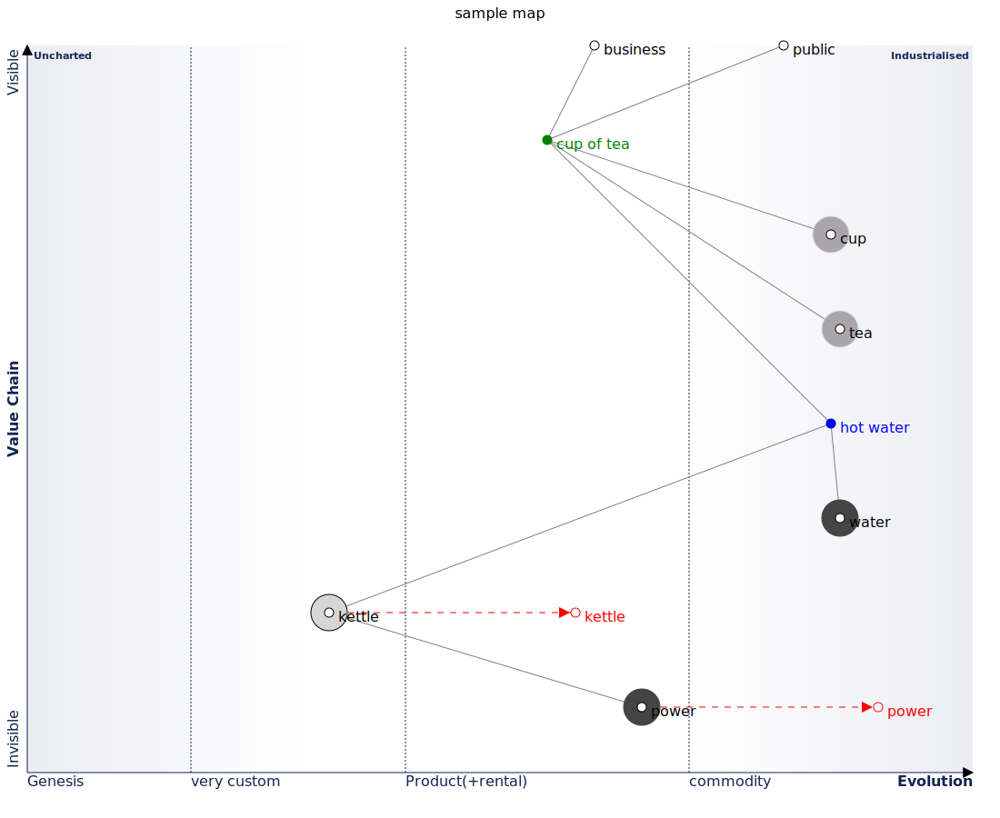
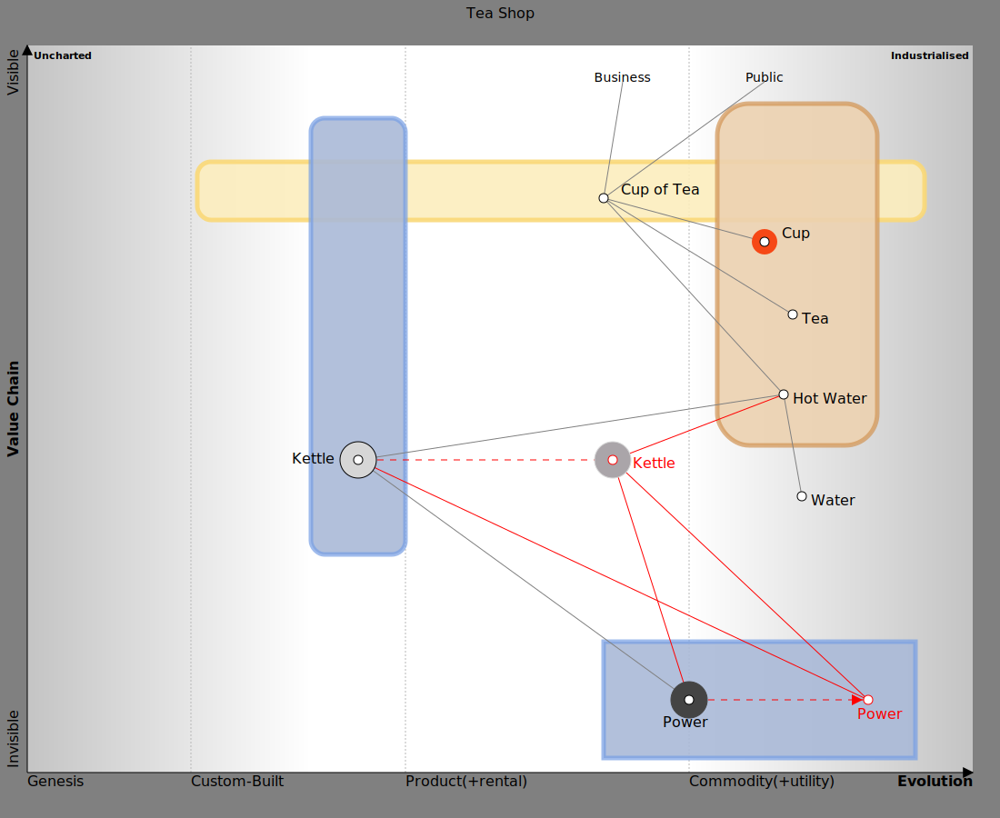

# WardleyToGo

[](https://pkg.go.dev/github.com/owulveryck/wardleyToGo)
[](https://codecov.io/gh/owulveryck/wardleyToGo)

A set of primitives to "code a map". In the context of the package "a map" represents a landscape.
The landscape is made of "Components". Each component knows its own location on a map.
Components can collaborate, meaning that they may be linked together. Therefore a map is also a graph.
The entrypoint of this API is the 'Map' structure

## wtg: language 

wtg is a high level language to design and render Wardley Maps implemented with this SDK.

Check the online demo (wtg playground) and the doc at [https://owulveryck.github.io/wardleyToGo/](https://owulveryck.github.io/wardleyToGo/)

Credits: this demo is heavily inspired by [GraphvizOnline](https://github.com/dreampuf/GraphvizOnline). It uses:

- [ACE-editor](https://github.com/ajaxorg/ace/blob/master/LICENSE) BSD-2
- [svg-pan-zoom](https://github.com/bumbu/svg-pan-zoom) BSD-2

## Using the library

### The wtg DSL

example:

```
title: sample map // title is optional
/***************
  value chain 
****************/

business - cup of tea
public - cup of tea
cup of tea - cup
cup of tea -- tea
cup of tea --- hot water
hot water - water
hot water -- kettle
kettle - power

/***************
  definitions 
****************/

// you can inline the evolution
business: |....|....|...x.|.........|

public: |....|....|....|.x...|

// or create blocks
cup of tea: {
  evolution: |....|....|..x..|........|
  color: Green // you can set colors
}
cup: {
  type: buy
  evolution: |....|....|....|....x....|
}
tea: {
  type: buy
  evolution: |....|....|....|.....x....|
}
hot water: {
  evolution: |....|....|....|....x....|
  color: Blue
}
water: {
  type: outsource
  evolution: |....|....|....|.....x....|
}

// you can set the evolution with a >
kettle: {
  type: build
  evolution: |...|...x.|..>.|.......|
}
power: {
  type: outsource
  evolution: |...|...|....x|.....>..|
}

stage1: genesis / concept
stage2: custom / emerging
stage3: product / converging
stage4: commodity / accepted
```

you will find tools to convert the file into SVG or dot format in the examples subdir or compiled version for various platforms in the repository

If you have Go installed, you can generate the map with

`cat sample.wtg | go run main.go > wtg.svg`

from the `examples/wtg2svg` directory



### The OWM parser

The library comes with a parser to handle part of the OWM syntax.

Create a map from the owm example (see [https://onlinewardleymaps.com/#h4hJOoRdO4hHSljIb9](https://onlinewardleymaps.com/#h4hJOoRdO4hHSljIb9) to build one):

[embedmd]:# (examples/parser/sample.owm)
```owm
title Tea Shop
anchor Business [0.95, 0.63]
anchor Public [0.95, 0.78]
component Cup of Tea [0.79, 0.61] label [19, -4]
component Cup [0.73, 0.78] label [19,-4] (dataProduct)
component Tea [0.63, 0.81]
component Hot Water [0.52, 0.80]
component Water [0.38, 0.82]
component Kettle [0.43, 0.35] label [-73, 4] (build)
evolve Kettle 0.62 label [22, 9] (buy)
component Power [0.1, 0.7] label [-29, 30] (outsource)
evolve Power 0.89 label [-12, 21]
Business->Cup of Tea
Public->Cup of Tea
Cup of Tea-collaboration>Cup
Cup of Tea-collaboration>Tea
Cup of Tea-collaboration>Hot Water
Hot Water->Water
Hot Water-facilitating>Kettle 
Kettle-xAsAService>Power
build Kettle


annotation 1 [[0.43,0.49],[0.08,0.79]] Standardising power allows Kettles to evolve faster
annotation 2 [0.48, 0.85] Hot water is obvious and well known
annotations [0.60, 0.02]

note +a generic note appeared [0.16, 0.36]

style wardley
streamAlignedTeam stream aligned A [0.84, 0.18, 0.76, 0.95]
enablingTeam team B [0.9, 0.30, 0.30, 0.40]
platformTeam team C [0.18, 0.61, 0.02, 0.94]
complicatedSubsystemTeam team D [0.92, 0.73, 0.45, 0.90]
```




## Developing with the library

### Example

First, create a component type

[embedmd]:# (example_draw_test.go /type dummyComponent.*/ /d.id }/)
```go
type dummyComponent struct {
	id       int64
	position image.Point
}

func (d *dummyComponent) GetPosition() image.Point { return d.position }

func (d *dummyComponent) String() string { return strconv.FormatInt(d.id, 10) }

func (d *dummyComponent) ID() int64 { return d.id }
```

Then a collaboration structure (an edge)

[embedmd]:# (example_draw_test.go /type dummyCollaboration.*/ /^}$/)
```go
type dummyCollaboration struct{ simple.Edge }

func (d *dummyCollaboration) GetType() wardleyToGo.EdgeType { return 0 }

func (d *dummyCollaboration) Draw(dst draw.Image, r image.Rectangle, src image.Image, sp image.Point) {
	coordsF := utils.CalcCoords(d.F.(wardleyToGo.Component).GetPosition(), r)
	coordsT := utils.CalcCoords(d.T.(wardleyToGo.Component).GetPosition(), r)
	drawing.Line(dst, coordsF.X, coordsF.Y, coordsT.X, coordsT.Y, color.Gray{Y: 128}, [2]int{})
}
```

And finally create the map

[embedmd]:# (example_draw_test.go /.*m \:= wardleyToGo.NewMap.*/ /.*c1, c3.*/)
```go
	m := wardleyToGo.NewMap(0)
	c0 := &dummyComponent{id: 0, position: image.Pt(25, 25)}
	c1 := &dummyComponent{id: 1, position: image.Pt(50, 50)}
	c2 := &dummyComponent{id: 2, position: image.Pt(50, 75)}
	c3 := &dummyComponent{id: 3, position: image.Pt(75, 75)}
	m.AddComponent(c0)
	m.AddComponent(c1)
	m.AddComponent(c2)
	m.AddComponent(c3)
	// c0 -> c1
	// c1 -> c2
	// c2 -> c3
	// c1 -> c3
	m.SetCollaboration(newCollaboration(c0, c1))
	m.SetCollaboration(newCollaboration(c1, c2))
	m.SetCollaboration(newCollaboration(c2, c3))
	m.SetCollaboration(newCollaboration(c1, c3))
```

## Generating image, png and so on.. (WIP)

the map fulfills the `drawer.Drawer` interface. If the components fulfills the interface as well, they are displayend on an image.

[embedmd]:# (examples/owm2png/main.go /func main.*/ $)
```go
func main() {
	p := owm.NewParser(os.Stdin)
	m, err := p.Parse() // the map
	if err != nil {
		log.Fatal(err)
	}
	im := image.NewRGBA(image.Rect(0, 0, 1400, 1100))
	canvas := image.Rect(100, 100, 1300, 1000)
	createBackground(im, canvas)

	m.Draw(im, canvas, im, image.Point{})
	png.Encode(os.Stdout, im)
}
```

see the [examples/pngoutput](examples/pngoutput) directory


