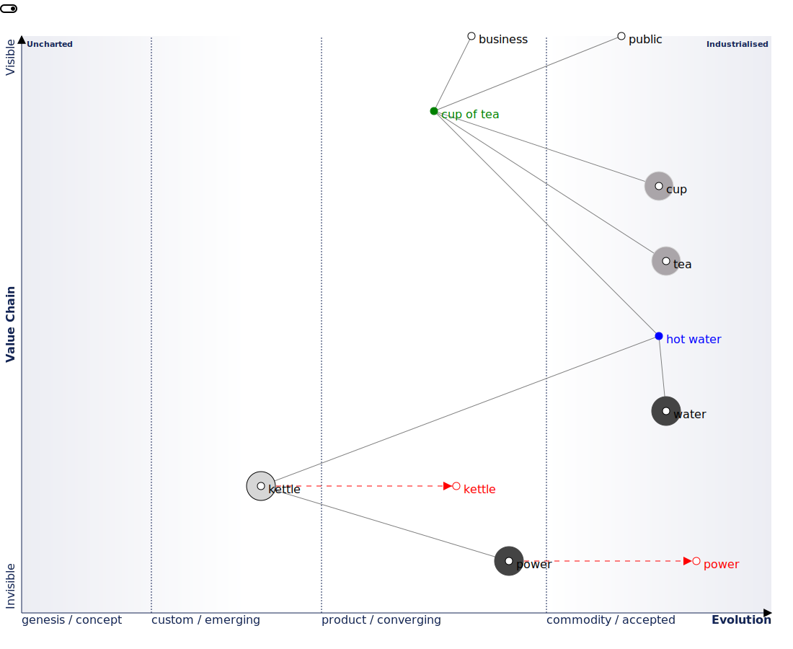

[](https://pkg.go.dev/github.com/owulveryck/wardleyToGo)
[](https://github.com/owulveryck/wardleyToGo/actions/workflows/go.yml)
[](https://codecov.io/gh/owulveryck/wardleyToGo)

## wardleyToGo


simple tools to play with Wardley maps in Go

```
❯ go run . << EOF
title Tea Shop
anchor Business [0.95, 0.63]
anchor Public [0.95, 0.78]
component Cup of Tea [0.79, 0.61] label [19, -4]
component Cup [0.73, 0.78]
component Tea [0.63, 0.81]
component Hot Water [0.52, 0.80]
component Water [0.38, 0.82]
component Kettle [0.43, 0.35] label [-57, 4]
evolve Kettle 0.62 label [16, 7]
component Power [0.1, 0.7] label [-27, 20]
evolve Power 0.89 label [-12, 21]
Business->Cup of Tea
Public->Cup of Tea
Cup of Tea->Cup
Cup of Tea->Tea
Cup of Tea->Hot Water
Hot Water->Water
Hot Water->Kettle 
Kettle->Power

streamalignedteam team A [0.47, 0.28, 0.38, 0.45]
EOF
```


