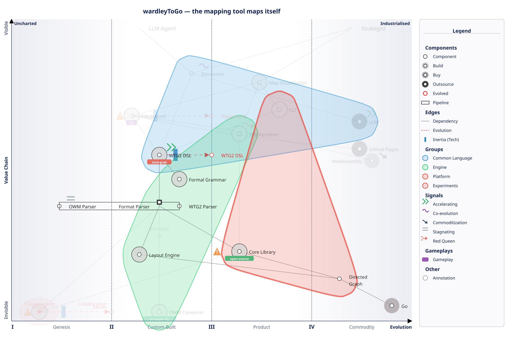

# wardleyToGo — The Mapping Tool Maps Itself

This directory contains the rendered output of `this_repo.wtg2`, the project's self-portrait as a Wardley Map. The map serves two purposes: it is a genuine strategic view of the project, and it is a showcase of the WTG2 language features.



## How to Read This Map

- **Vertical axis (Value Chain):** Components at the top are directly visible to users. Components lower down are dependencies — libraries, algorithms, infrastructure.
- **Horizontal axis (Evolution):** Components move left-to-right as they mature through four phases: Genesis (I), Custom-Built (II), Product (III), Commodity (IV).
- **Groups** are colored blobs that visually cluster related components. Each group declares a team type (explorer/settler/town-planner) aligned with the EVT model.
- **Focus** dims everything outside the WTG2 DSL dependency subtree, drawing attention to the project's strategic center.

## Anchors

The map has two anchors representing distinct user personas:

| Anchor | Position | Meaning |
|--------|----------|---------|
| **Strategist** | IV.4 | Human practitioners. Strategic mapping is a well-established practice — the _method_ is mature even if specific tools are not. |
| **LLM Agent** | II.3 | AI agents generating maps via WTG2. This is a custom-built capability — LLMs can produce WTG2, but the workflow is still bespoke and evolving. |

The asymmetry is strategic: the Strategist needs both **Map Visualization** (to see SVG output) and **Discussion** (to participate in strategic conversations). The LLM Agent only connects to **Discussion** (it generates WTG2 text, not visual output). This reveals that **WTG2 DSL is the universal layer** — it serves both humans and machines, while visualization is human-specific.

## Component Positioning Rationale

### Visible Layer (top of value chain)

| Component | Position | Rationale |
|-----------|----------|-----------|
| **Map Visualization** | III.5 | The rendered SVG output. Wardley Map visualization is an established product concept, but this specific renderer is built in-house. |
| **Discussion** | II.8 | Strategic conversations that produce and consume maps. The practice of discussing strategy via maps is understood but still bespoke. Classified as `social` capital. |
| **LLM** | IV.5 (outsource) | Large language model APIs (OpenAI, Anthropic, Google). These are commodity services consumed, not built. Classified as `relational` capital — the value is in the API relationship. |

### The Language

| Component | Position | Rationale |
|-----------|----------|-----------|
| **WTG2 DSL** | II.5 >> III.0 | The domain-specific language is custom-built and actively evolving (signals, gameplays, qualified inertia were recently added). Strong technical inertia (`!!(tech)`) because grammar backward-compatibility constrains how fast it can change. |
| **Formal Grammar** | II.7 | The BNF specification. More mature than the DSL itself because formal grammars are a well-understood discipline, but this specific grammar is custom. |

### Parser Pipeline

| Component | Position | Rationale |
|-----------|----------|-----------|
| **Format Parser** | II.5 | The parsing subsystem, declared as a **pipeline** with two implementations at different evolution stages. |
| **WTG2 Parser** (pipeline member) | II.7 | The main parser — hand-crafted lexer/parser/AST/builder. Custom-built but following well-known compiler patterns. |
| **OWM Parser** (pipeline member) | I.5 | OnlineWardleyMaps compatibility parser. Experimental, stagnating. Being strangler-figged away via the OWM Converter. |

The pipeline visually shows both parser implementations spanning from I.5 to II.7 on the evolution axis.

### Layout and Rendering

| Component | Position | Rationale |
|-----------|----------|-----------|
| **Layout Engine** | II.3 | Genuinely novel: combines Kahn topological sort with force-directed spacing to compute Y-axis positions from the dependency graph. This is the project's unique differentiator — it computes what the language deliberately omits. |
| **SVG Renderer** | III.3 | An encoder with CSS/JS themes, legend, and focus mode. Product-level maturity. Subject to red-queen dynamics — every new WTG2 feature requires corresponding rendering support. |

### Delivery Channels

| Component | Position | Rationale |
|-----------|----------|-----------|
| **Playground** | II.2 >> III.0 | Interactive browser-based editor, compiled to WASM and deployed to GitHub Pages. Evolving from demo to product, but WASM constraints create `!(tech)` inertia. |
| **CLI** | III.7 | `wtg2svg` — standard Unix pipeline tool (stdin/stdout). Very mature pattern. |
| **OWM Converter** | II.5 | `owm2wtg2` — a bridge that transpiles OnlineWardleyMaps format to WTG2. Part of the strangler-fig strategy. |

### Core SDK

| Component | Position | Rationale |
|-----------|----------|-----------|
| **Core Library** | III.3 | The public Go API: Map, Component, Collaboration, Area interfaces. Product-level with stable contracts. Zero external dependencies by design. Main maintenance burden — breaking changes cascade everywhere. |

### Experimental

| Component | Position | Rationale |
|-----------|----------|-----------|
| **Collaboration Server** | I.3 >> II.0 | Real-time multiplayer map editing via WebSocket. Genesis-phase, evolving toward custom-built. The project's only module with an external dependency (`coder/websocket`), creating `!(tech)` inertia. Colored red (#E74C3C) to visually flag its experimental status. |

### Infrastructure

| Component | Position | Rationale |
|-----------|----------|-----------|
| **Directed Graph** | IV.3 | Graph algorithms (topological sort, traversal) — textbook computer science. |
| **GitHub Pages** | IV.5 (outsource) | Commodity static hosting for the Playground. |
| **WebAssembly** | IV.6 (buy) | Compilation target — becoming invisible infrastructure. |
| **Go** | IV.8 (buy) | The Go programming language — deep commodity. |

## Groups and Team Alignment

The map uses four groups, three of which declare team types following the Explorer-Villager-Town-planner (EVT) model:

| Group | Team Type | Components | Rationale |
|-------|-----------|------------|-----------|
| **Common Language** | _(none)_ | Discussion, LLM, WTG2 DSL | A conceptual group, not an organizational one. Represents the strategic insight that WTG2 serves as a common language between humans and machines. No team type because it spans a concept, not a team. |
| **Engine** | Settler | Formal Grammar, Format Parser, Layout Engine, SVG Renderer, OWM Converter | The productization team. Settlers take custom-built components and turn them into reliable products. These components are in phases II-III, exactly where settlers operate. |
| **Platform** | Town-Planner | Core Library, Directed Graph, CLI | The industrialization team. Town-planners maintain mature, stable infrastructure. These components are in phases III-IV — stable, well-understood, optimized for reliability. |
| **Experiments** | Explorer | Collaboration Server | The discovery team. Explorers work in Genesis-phase uncertainty. The Collaboration Server at I.3 is the only true Genesis component. Colored red to visually distinguish experimental work. |

**EVT alignment check:** Explorer team owns Genesis (I) components, settler team owns Custom-Product (II-III) components, town-planner team owns Product-Commodity (III-IV) components. No mismatches.

## Evolution and Inertia

Three components show active evolution movement (`>>`):

| Component | From | To | Inertia | Explanation |
|-----------|------|----|---------|-------------|
| **WTG2 DSL** | II.5 | III.0 | `!!(tech)` — strong | The language is evolving toward product maturity, but grammar backward-compatibility creates significant technical resistance. Every syntax change must preserve existing `.wtg2` files. |
| **Playground** | II.2 | III.0 | `!(tech)` — moderate | Moving from demo to product, but WASM binary size and Go compilation constraints slow evolution. |
| **Collaboration Server** | I.3 | II.0 | `!(tech)` — moderate | Moving from genesis to custom-built, but the external dependency on `coder/websocket` creates friction that doesn't exist elsewhere in the stdlib-only codebase. |

All three have `tech` inertia — the resistance is technological in nature, not financial, human, relational, or social.

## Signals

Market dynamics and climatic patterns annotated on the map:

| Signal | Component | Interpretation |
|--------|-----------|----------------|
| **accelerating** | LLM | LLM APIs are rapidly commoditizing and improving — strong tailwind for the project. |
| **accelerating** | WTG2 DSL | The language is gaining features and users, accelerated by LLM adoption. |
| **co-evolution** | Discussion | Strategic discussion and the WTG2 language co-evolve: richer language enables richer discussions, which demand more language features. A classic climatic pattern. |
| **commoditization** | WebAssembly | WASM is becoming invisible infrastructure — gravitational pull toward utility. |
| **stagnating** | OWM Parser | The legacy format parser has plateaued. No new features, being replaced by the WTG2 Parser. |
| **red-queen** | SVG Renderer | Must constantly evolve (legend, focus, signals, gameplays rendering) just to keep up with WTG2 language additions. Running to stay in place. |

## Gameplays

Four strategic maneuvers are annotated:

| Gameplay | Component | Description |
|----------|-----------|-------------|
| **open-source** | Core Library | The entire project is open source, deliberately commoditizing the mapping infrastructure to capture value in the adjacent language layer (WTG2 DSL). Classic open-source gameplay: give away the platform, own the ecosystem. |
| **strangler-fig** | OWM Converter | Progressively replacing the legacy OnlineWardleyMaps format by providing a migration bridge (`owm2wtg2`). Users can convert existing OWM maps to WTG2, then never look back. The `stagnating` signal on OWM Parser confirms the strategy is working. |
| **land-grab** | WTG2 DSL | Attempting to become the default language for LLM-based Wardley Map generation. The `skill.md` file serves as a training artifact — when LLMs learn WTG2, adoption follows. First-mover advantage in a market with network effects. |
| **ILC** | Playground | Innovate-Leverage-Commoditize: the Playground lets users experiment with WTG2 (innovate), successful patterns inform the language specification (leverage), and the CLI commoditizes the rendering for production use. |

## Warnings

Three strategic risks are flagged:

| Warning | Component | Risk |
|---------|-----------|------|
| "Single maintainer — bus factor of 1" | Core Library | The most critical risk. The core library is the foundation of everything — a single-point-of-failure from an organizational perspective. |
| "WASM binary size growing — monitor load times" | Playground | Technical risk for the primary delivery channel. As the Go codebase grows, the compiled WASM binary gets larger, increasing initial load times. |
| "Experimental — API unstable" | Collaboration Server | Signals to potential adopters that this component has no backward-compatibility guarantee. |

## Focus: WTG2 DSL

The `focus WTG2 DSL` directive highlights the WTG2 DSL component and its entire dependency subtree. Everything outside the focus tree is rendered at reduced opacity.

This focus was chosen because WTG2 DSL is the project's **central differentiator** — it's the component where the land-grab gameplay is applied, the one that both anchors ultimately depend on (directly or through Discussion), and the layer where the open-source strategy captures value. The focus subtree includes: Formal Grammar, Format Parser (with both pipeline members), Layout Engine, Core Library, Directed Graph, and Go — the full stack from language to infrastructure.

## WTG2 Features Exercised

This map uses the following WTG2 language features:

| Feature | Example in this map |
|---------|-------------------|
| Metadata (title, date, author, scope, question) | All five fields populated |
| `doctrine:` | `context` |
| `stages:` | Genesis, Custom-Built, Product, Commodity |
| `legend` | Auto-generated legend panel |
| `anchor` with evolution | `anchor Strategist : IV.4` |
| Component (shorthand) | `Directed Graph : IV.3` |
| Component (block) | `WTG2 DSL : II.5 !!(tech) >> III.0 { ... }` |
| `type:` (build/buy/outsource) | build, buy, outsource all used |
| `asset:` | tech, social, relational |
| Evolution `>>` | 3 components with movement arrows |
| Qualified inertia `!!(kind)` | `!!(tech)` on WTG2 DSL |
| Moderate inertia `!(kind)` | `!(tech)` on Playground, Collaboration Server |
| `pipeline` | Format Parser with OWM Parser + WTG2 Parser |
| `group` | 4 groups |
| `team:` in groups | explorer, settler, town-planner |
| `color:` in groups | `#E74C3C` on Experiments |
| `color:` on components | `#E74C3C` on Collaboration Server |
| `cost:` | Core Library, Collaboration Server |
| `note:` (inline) | 7 components with inline notes |
| `note` (annotation) | 3 standalone notes |
| `warning` | 3 warnings |
| `signal` | 6 signals (accelerating, co-evolution, commoditization, stagnating, red-queen) |
| `gameplay` | 4 gameplays (open-source, strangler-fig, land-grab, ILC) |
| `focus` | WTG2 DSL |
| Annotated edge `-[text]->` | `OWM Converter -[transpiles to]-> WTG2 DSL` |
| Edge chains | `Format Parser -> Layout Engine -> Directed Graph` |
| Comments | Section dividers throughout |

## Regenerating

To regenerate the SVG and PNG from the source:

```bash
# From the repository root
cat this_repo.wtg2 | go run ./cmd/wtg2svg/ > examples/self-map/this_repo.svg
inkscape examples/self-map/this_repo.svg --export-type=png --export-filename=examples/self-map/this_repo.png --export-width=2200
```
