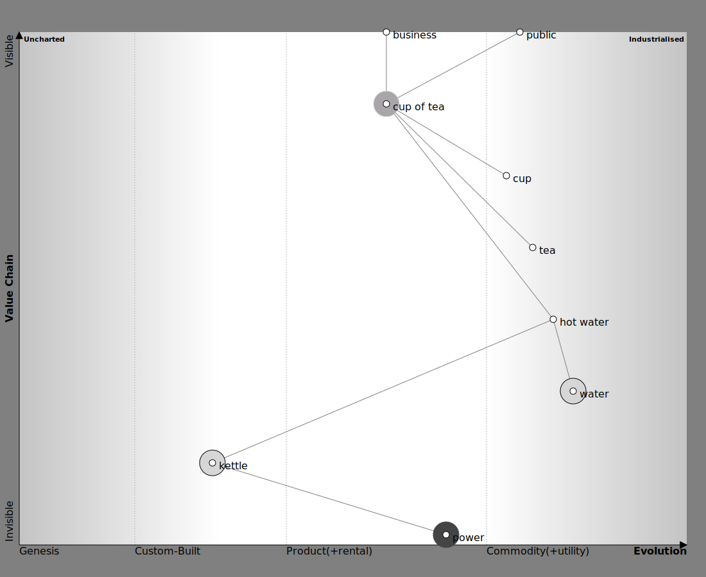
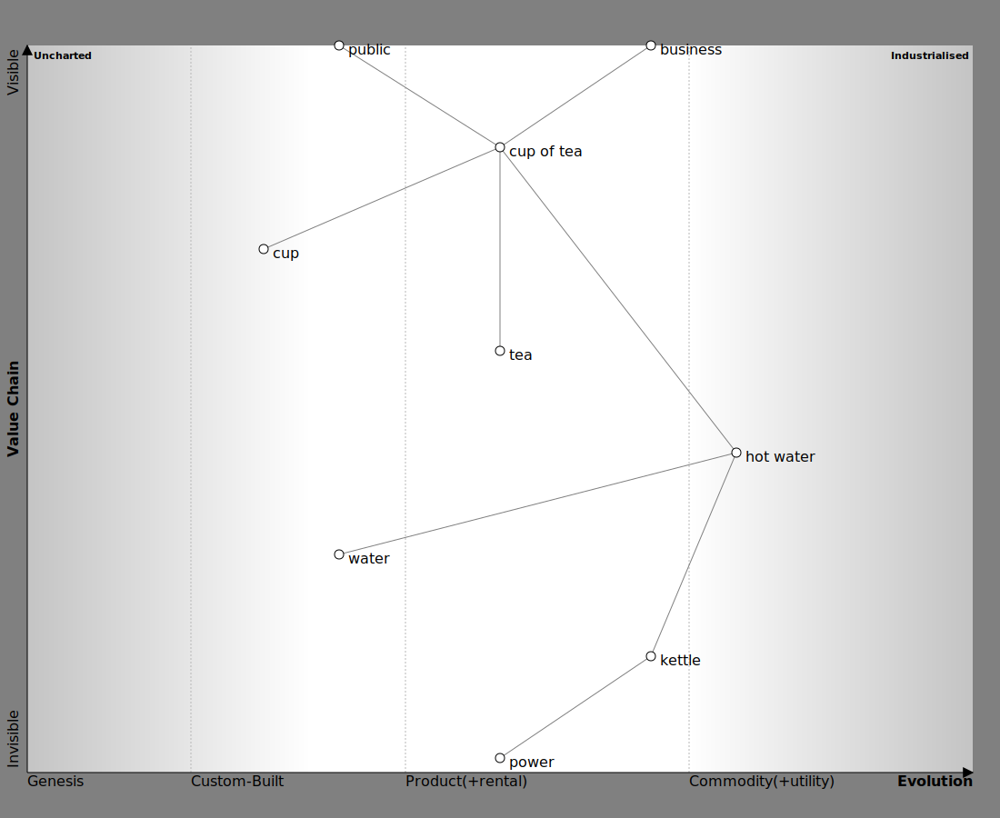

## Quick start
Given sample.txt with this content

```text
business - cup of tea
public - cup of tea
cup of tea - cup
cup of tea -- tea
cup of tea --- hot water
hot water - water
hot water -- kettle
kettle - power

cup of tea: {
    type: buy
    evolution: |....|....|...x..|.........|
}
water: {
    type: build
    evolution: |....|....|....|....x....|
}
kettle: {
    type: build
    evolution: |....|..x.|....|.........|
}
power: {
    type: outsource
    evolution: |....|....|....x|.........|
}
business: {
    evolution: |....|....|..x.|.......|
}
public: {
    evolution: |....|....|....|.x....|
}
cup: {
    evolution: |....|....|....|.x.......|
}
tea: {
    evolution: |....|....|....|..x......|
}
hot water: {
    evolution: |....|....|....|...x.....|
}
```

When we execute

```shell
cat sample.txt | go run cmd/wtg2svg/main.go > sample.svg
```

The result is



## Howto

### First create the value chain
Create your value chain simply in a file (for example `vc.txt`)

```text
business - cup of tea
public - cup of tea
cup of tea - cup
cup of tea -- tea
cup of tea --- hot water
hot water - water
hot water -- kettle
kettle - power
```

#### Test the value chain in dot

`cat vc.txt | go run cmd/wtg2dot/main.go | dot -Tsvg > vc_dot.svg`

which renders in


#### Test the value chain in maps

`cat vc.txt | go run cmd/wtg2svg/main.go > vc_wardley.svg`

which renders in



### Create the evolution file

You can use the dump command to generate some boilerplate for the components:

```shell
cat vc.txt | go run cmd/dump/main.go | while read line
do
echo "$line: {"
echo "    evolution: |....|....|....|....x....|"
echo "}"
done > evolution.txt
```

Then adapt the file

#### Generate the maps

`cat vc.txt evolution.txt | go run cmd/wtg2svg/main.go > map.svg`
